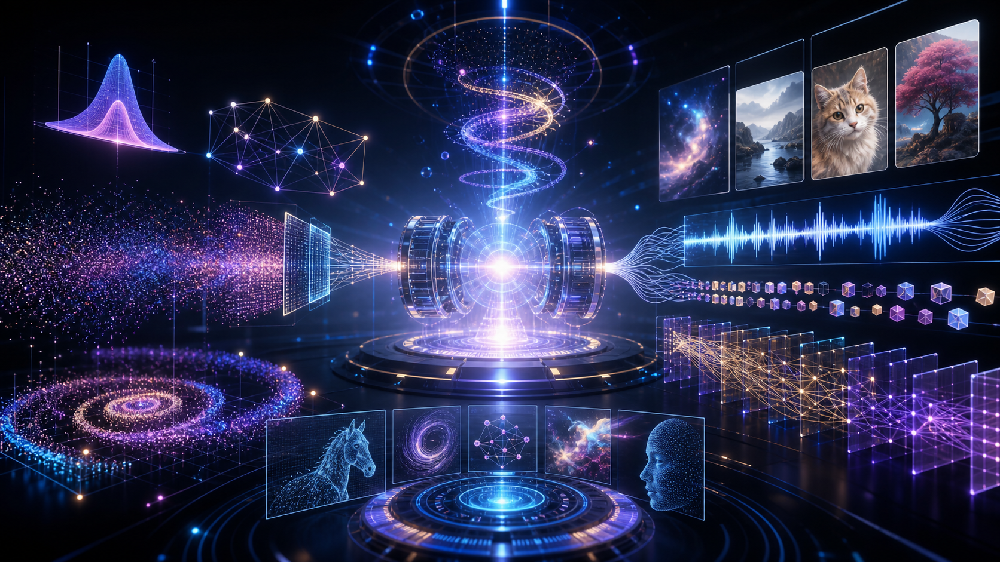

# Generative Deep Learning - Models, Media, and Modern LLM Systems

  

An advanced course in generative modeling, from VAEs and GANs to diffusion models, transformers, multimodal systems, world models, music generation, and modern LLM engineering. This repository follows the practical arc of David Foster's *Generative Deep Learning* and adds structured review, capstone planning, and modern system-building supplements.

The course is for learners who want to build generative systems and understand what those systems are doing: what distribution is being learned, what latent space means, why sampling works, how evaluation can fail, and how modern LLM applications combine prompting, retrieval, adaptation, alignment, and deployment constraints.

## Who This Course Is For

- Deep learning practitioners moving into generative AI.
- Students who want implementation-level understanding of VAEs, GANs, diffusion, and transformers.
- Builders designing creative tools, multimodal systems, or LLM-backed products.
- Researchers preparing to read current generative modeling papers.

You should already understand neural networks, optimization, and Python-based model training. Course 3 is the recommended theory companion.

## What You Will Be Able To Do

By the end of the course, you will be able to:

1. Explain the difference between discriminative and generative modeling.
2. Build and evaluate VAEs, GANs, autoregressive models, normalizing flows, energy-based models, and diffusion models.
3. Understand transformer architecture and its role in text, image, and multimodal generation.
4. Analyze latent spaces, sampling procedures, guidance, reconstruction, fidelity, diversity, and alignment.
5. Compare DALL-E-style, Imagen-style, Stable Diffusion, CLIP, and Flamingo-like multimodal systems.
6. Design modern LLM workflows using RAG, LoRA, preference optimization, quantization, caching, tools, and evaluation harnesses.
7. Plan a capstone generative system with ethical and safety constraints.

## Curriculum Map

| Chapter | Focus | Sections |
|---------|-------|----------|
| [01](./chapters/chapter-01-generative-modeling/README.md) | Generative Modeling | 8 |
| [02](./chapters/chapter-02-deep-learning/README.md) | Deep Learning | 9 |
| [03](./chapters/chapter-03-variational-autoencoders/README.md) | Variational Autoencoders | 9 |
| [04](./chapters/chapter-04-generative-adversarial-networks/README.md) | Generative Adversarial Networks | 9 |
| [05](./chapters/chapter-05-autoregressive-models/README.md) | Autoregressive Models | 9 |
| [06](./chapters/chapter-06-normalizing-flow-models/README.md) | Normalizing Flow Models | 9 |
| [07](./chapters/chapter-07-energy-based-models/README.md) | Energy-Based Models | 8 |
| [08](./chapters/chapter-08-diffusion-models/README.md) | Diffusion Models | 9 |
| [09](./chapters/chapter-09-transformers/README.md) | Transformers | 10 |
| [10](./chapters/chapter-10-advanced-gans/README.md) | Advanced GANs | 9 |
| [11](./chapters/chapter-11-music-generation/README.md) | Music Generation | 9 |
| [12](./chapters/chapter-12-world-models/README.md) | World Models | 9 |
| [13](./chapters/chapter-13-multimodal-models/README.md) | Multimodal Models | 9 |
| [14](./chapters/chapter-14-conclusion/README.md) | Conclusion | 10 |

## How To Study

Generative modeling rewards experimentation. For every chapter, keep a prompt log, seed log, metric log, and failure log. Compare outputs qualitatively and quantitatively. When a model produces a beautiful sample, ask what distributional shortcut may have made it possible. When it fails, ask whether the issue is data, architecture, objective, sampling, or evaluation.

## Capstone

The capstone is a generative system proposal and implementation plan. You will choose a modality, justify an architecture, define evaluation criteria, identify risks, and optionally build a small prototype. The final chapter includes a modern LLM mini-lab for tiny RAG evaluation and LoRA decision-making. See [the capstone specification](./projects/capstone/README.md).

## Repository Guide

| Path | Purpose |
|------|---------|
| `chapters/` | Course chapters and section files |
| `projects/` | Capstone project specification and rubrics |
| `resources/` | Supplementary references and study aids |
| `assets/` | Repository banner and visual assets |
| `GLOSSARY.md` | Shared technical vocabulary |
| `MATH_CONVENTIONS.md` | Math formatting conventions |
| `ASSESSMENT_APPENDIX.md` | Reusable mastery prompts and review templates |

## Source And Attribution

This is an independent educational curriculum inspired by David Foster's *Generative Deep Learning* (2nd edition). It is not a replacement for the book. Use the original text and code resources as the primary reference and this repository as a structured companion for study, labs, review, and capstone work.

## Start Here

Begin with [Chapter 01: Generative Modeling](./chapters/chapter-01-generative-modeling/README.md).
